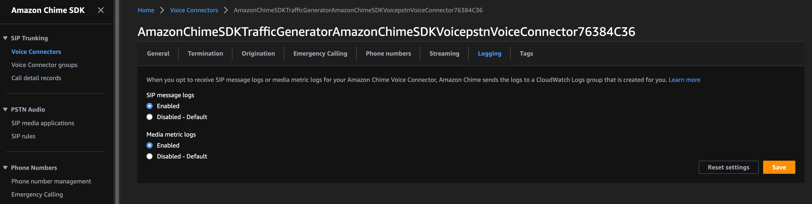
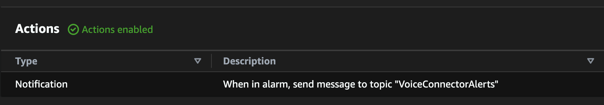

# Amazon Chime SDK Voice Connector CLoudwatch Dashboard and Alarms

This demo will serve as a starting point for using Amazon CloudWatch to monitor and alert on your Amazon Chime SDK Voice Connectors.

## Logging

The first thing we'll want to do is enable logging for your Amazon Chime SDK Voice Connectors. This can be enabled in the AWS Console, through [AWS Command Line Interface](https://awscli.amazonaws.com/v2/documentation/api/latest/reference/chime-sdk-voice/put-voice-connector-logging-configuration.html) (CLI), or by [API](https://docs.aws.amazon.com/chime-sdk/latest/APIReference/API_voice-chime_PutVoiceConnectorLoggingConfiguration.html).



There are two options for logging here that will generate different types of logs that we will use later.

- SIP message logs
- Media metric logs

The [log groups](https://docs.aws.amazon.com/AmazonCloudWatch/latest/logs/Working-with-log-groups-and-streams.html) are created in the Region the Amazon Chime SDK Voice Connector is located and will have the names `/aws/ChimeVoiceConnectorSipMessages/{VOICE_CONNECTOR_ID}` and `/aws/ChimeVoiceConnectorLogs/{VOICE_CONNECTOR_ID}`.

Detailed information about these logs is available here: https://docs.aws.amazon.com/chime-sdk/latest/ag/monitoring-cloudwatch.html

## Amazon Chime SDK Voice Connector Metrics

Several [Amazon CloudWatch metrics](https://docs.aws.amazon.com/AmazonCloudWatch/latest/monitoring/working_with_metrics.html) exist for the Amazon Chime SDK Voice Connectors in the `AWS/ChimeVoiceConnector` namespace. We will be using these to create dashboards and alarms.

- InboundCallsActive
- InboundCallFailures
- OutboundCallsActive
- OutboundCallFailures
- MOSBetweenVcAndCustomer
- RTTBetweenVcAndCustomer
- VcToCustomerRtpPackets
- CustomerToVcRtpPackets
- VcToCustomerJitter
- CustomerToVcJitter

## Dashboard

### CallsActive CallsFailure - Dashboard

The most basic metric will capture active and failed calls.


The dashboard created in this AWS Cloud Development Kit (CDK) includes an [Amazon CloudWatch widget](https://docs.aws.amazon.com/AmazonCloudWatch/latest/monitoring/create-and-work-with-widgets.html) that tracks active and failed calls. This widget provides a quick look to verify that inbound and/or outbound calls are establishing correctly. Active calls are tracked here along with calls that have had 4xx, 5xx, or 6xx [SIP response codes](https://datatracker.ietf.org/doc/html/rfc3261#section-21). However, just because a call received a 4xx, 5xx, or 6xx response does not necessarily mean that the entire call failed. For example, if an Amazon Chime SDK Voice Connector is configured with multiple inbound routes and the first attempt receives a [`503 Service Unavailable`](https://datatracker.ietf.org/doc/html/rfc3261#section-21.5.4), a second attempt will be made to another host. This can result in a call being active while still having experienced a failure.

### Mean Opinion Score (MOS), Round Trip Time (RTT), Jitter, and Packet Loss

MOS, RTT, jitter, and packet loss are metrics that are generated by Amazon Chime SDK Voice Connector to provide information about the Real-time Transport Protocol (RTP) that can be used to estimate the quality of the call. These metrics are enhanced by enabling [RTP Control Protocol](https://datatracker.ietf.org/doc/html/rfc3550#section-6) (RTCP) in your device.

#### MOS and RTT

MOS and RTT are not directional metrics, but will be generated for the leg of the call between the Amazon Chime SDK Voice Connector and customer device.

```json
{
  "rtt_btwn_vc_and_cust": 19434,
  "mos_btwn_vc_and_cust": 4.3
}
```

In this case, the RTT between the voice connector and customer is `19434` microseconds or `19.434` milliseconds. The MOS between the voice connector and customer is `4.3`. This is an estimated MOS calculated based on the other metrics: RTT, jitter, and packet loss.


#### Jitter

Jitter is a generated metric that can be seen in the media metric logs:

```json
{
  "cust2vc_jitter": 0,
  "vc2cust_jitter": 0
}
```

In this example, no jitter was observed between the customer and the voice connector and also between the voice connector and customer. Jitter can vary by direction and is measured in microseconds.


#### Packet Loss

Packet loss is slightly different than other generated metrics. Packet loss accumulates for the duration of the call. However, we can calculate the packets lost in a particular minute, by looking at the RTP Packets sent in that minute and subtracting from `3000`. Because RTP is sent every 20ms and there are 60,000 milliseconds in a minute, every minute should contain 3,000 RTP packets in each direction.

```json
{
  "cust2vc_rtp_packets": 3000,
  "cust2vc_packets_lost": 0,
  "vc2cust_rtp_packets": 283,
  "vc2cust_rtp_bytes": 48676,
  "vc2cust_packets_lost": 6026
}
```

In this example, we can see that `3000` RTP packets were sent from the customer to the voice connector. That means there was 0% packet loss in that direction. However, we can see that only `283` packets were sent from the voice connector to the customer. That means that `2717` packets were not received for a 90.6% `(2717/3000)` packet loss in that direction. Additionally, we can see that a total of `6026` packets have been lost between the voice connector and customer over the course of this call. This assumes that the [`ptime`](https://www.rfc-editor.org/rfc/rfc4566#section-6) of the call is 20ms. If the `ptime` of your call is different, this calculation will need to be adjusted.


## Alarms

In addition to the dashboard created in this demo, several [Amazon CloudWatch Alarms](https://docs.aws.amazon.com/AmazonCloudWatch/latest/monitoring/AlarmThatSendsEmail.html) have been created to get you started customizing monitoring and alerting on your environment.

Alarms have been created for the following metrics:

- InboundCalls_us-east-1
- OutboundCalls_us-east-1
- MOS_us-east-1
- RTT_us-east-1
- VcToCustomerPacketLoss_us-east-1
- CustomerToVcPacketLoss_us-east-1
- VcToCustomerJitter_us-east-1
- CustomerToVcJitter_us-east-1
- Sip4xxCodes_us-east-1
- Sip5xxCodes_us-east-1
- Sip6xxCodes_us-east-1

These alarms metrics are similar to the widgets creating the dashboard with the addition of `Sip4xxCodes`, `Sip5xxCodes`, `Sip6xxCodes`.

### Alarm Details

Alarms are [evaluated](https://docs.aws.amazon.com/AmazonCloudWatch/latest/monitoring/AlarmThatSendsEmail.html#alarm-evaluation) with three settings:

> When you create an alarm, you specify three settings to enable CloudWatch to evaluate when to change the alarm state:
>
> Period is the length of time to use to evaluate the metric or expression to create each individual data point for an alarm. It is expressed in seconds.
>
> Evaluation Periods is the number of the most recent periods, or data points, to evaluate when determining alarm state.
>
> Datapoints to Alarm is the number of data points within the Evaluation Periods that must be breaching to cause the alarm to go to the ALARM state. The breaching data points don't have to be consecutive, but they must all be within the last number of data points equal to Evaluation Period.
>
> For any period of one minute or longer, an alarm is evaluated every minute and the evaluation is based on the window of time defined by the Period and Evaluation Periods. For example, if the Period is 5 minutes (300 seconds) and Evaluation Periods is 1, then at the end of minute 5 the alarm evaluates based on data from minutes 1 to 5. Then at the end of minute 6, the alarm is evaluated based on the data from minutes 2 to 6.


For `InboundCallsAlarms` we use a threshold of `Inbound Call Failure % >= 10 for 1 datapoints within 1 minute`.

When this occurs, the state of the alarm will be set to `In alarm`. The history of the alarm will reflect these state changes.


### Alerts

In addition to the Alarms that are generated, actions can be performed when an Alarm changes state. In this starting point, when in alarm, a message will be sent to an [Amazon Simple Notification Service](https://docs.aws.amazon.com/sns/latest/dg/sns-getting-started.html) (SNS) topic.



Messages sent to this topic can be subscribed to with a variety of endpoints including email and SMS.


When an alarm is trigger, a message will be sent to the configured subscriptions.


## Logs Insights

[Amazon CloudWatch Log Insights](https://docs.aws.amazon.com/AmazonCloudWatch/latest/logs/AnalyzingLogData.html) can also be configured and are included in this starting point. Log Insights can be used to search and analyze log data in Amazon CloudWatch Logs using a query language. In this demo, queries will be created that reference existing Amazon Chime Voice Connectors that have logging enabled in your account. These queries are available in the Amazon CloudWatch console.


In this example, a query can be run that will return SIP messages from the SIP message Log Groups.


### Filtering

These queries can be customized to filter for specific messages.

```text
fields @timestamp, call_id, sip_message, @logStream
| parse sip_message '*\n' as sip
| filter sip like /(SIP\/2.0 5|SIP\/2.0 4|SIP\/2.0 6)/
| display @timestamp, sip, @logStream
| sort @timestamp desc
| limit 50
```

In this example, the query will filter for SIP 4xx, 5xx, and 6xx messages.

## Costs

Please be aware that costs can be incurred using this starting point. Pricing details can be found here: https://aws.amazon.com/cloudwatch/pricing/

## Deploy

Deploying this CDK will create a CloudWatch dashboard along with alarms and queries in `us-east-1` and `us-west-2`. To deploy this CDK:

```
yarn launch
```

## Destroy

The resources created here can be removed by destroying the CDK:

```
yarn delete
```
